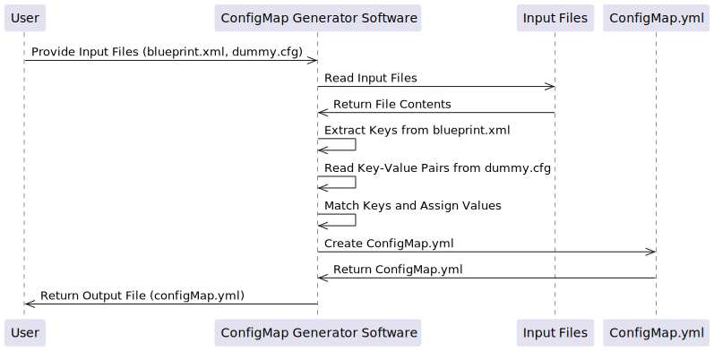

# 🧾 Approach Document for ConfigMap Generator Software (Quarkus Framework)

## Architecture Diagram


## 📚 Table of Contents
1. [🎯 Objective](#-objective)
2. [🔧 Technologies Used](#-technologies-used)
3. [🧠 High-Level Working](#-high-level-working)
4. [📁 Input Files](#-input-files)
5. [🚀 Step-by-Step Execution Flow](#-step-by-step-execution-flow)
6. [📤 Output Files](#-output-files)
7. [🧪 Testing Ideas](#-testing-ideas)
8. [📌 Future Scope](#-future-scope)

## 🎯 Objective
The main goal of this software is to:

> Extract all `{{keys}}` from a `blueprint.xml` file, match them with a `dummy.cfg` file, and create a `ConfigMap.yml` file.

- If the key exists in the `.cfg` file ➡️ use the actual value.
- If the key is missing ➡️ use `null` as the value.

---

## 🔧 Technologies Used
- Java 17
- Quarkus Framework
- Maven
- Simple XML Parser
- Java File Reader / Writer

---

## 🧠 High-Level Working
1. User provides 2 input files:
   - `blueprint.xml` (contains placeholders like `{{some.key}}`)
   - `dummy.cfg` (key-value config file)
2. The program extracts all placeholders (keys) from the XML file.
3. It checks each key in the `.cfg` file:
   - If match is found → fetch value
   - If not found → assign `null`
4. A new `ConfigMap.yml` file is created with all key-value pairs.
5. It also creates a cleaned `.cfg` file showing matched and unmatched keys.

---

## 📁 Input Files

### 1. `blueprint.xml`
```xml
<route>
  <to uri="http://{{api.host}}/call"/>
  <to uri="jms:queue:{{jms.queue.name}}"/>
</route>
```

### 2. `dummy.cfg`
```properties
api.host=localhost:8080
jms.queue.name=paymentQueue
```

---

## 🚀 Step-by-Step Execution Flow

### 🥇 Step 1: Read the XML File
- Open the `blueprint.xml` file.
- Search for all `{{...}}` patterns.
- Extract key names like `api.host`, `jms.queue.name`.

### 🥈 Step 2: Read the `.cfg` File
- Load the `dummy.cfg` file.
- Store all key-value pairs in a `Map`.

### 🥉 Step 3: Match Keys
- For each extracted key from XML:
  - If the key exists in `.cfg`, get its value.
  - Else, assign `null`.

### 🏁 Step 4: Write `configMap.yml`
- Format the matched values into this format:
```yaml
apiVersion: v1
kind: ConfigMap
metadata:
  name: my-config
data:
  api.host: "localhost:8080"
  jms.queue.name: "paymentQueue"
  some.missing.key: "null"
```

### 📝 Step 5: Optional - Create `extractedValues.cfg`
```properties
api.host=localhost:8080
jms.queue.name=paymentQueue
some.missing.key=null
```

---

## 📤 Output Files

| File Name             | Purpose                                        |
|----------------------|------------------------------------------------|
| `configMap.yml`       | Final output for Kubernetes ConfigMap         |
| `extractedValues.cfg` | Log file with resolved key-value pairs        |

---

## 🧪 Testing Ideas

| Test Case                        | Expected Result                                    |
|----------------------------------|----------------------------------------------------|
| All keys match in `.cfg`         | All keys in `configMap.yml` have actual values     |
| Some keys missing                | Missing keys show `"null"` in `configMap.yml`      |
| Extra keys in `.cfg` file        | Only keys from XML are used, extras ignored        |
| Special characters in values     | Values are enclosed in quotes `"..."`              |
| Empty `dummy.cfg` file           | All values in `configMap.yml` will be `"null"`     |

---

## 📌 Future Scope
- Add UI for selecting files
- Support YAML templates with default values
- Auto-upload generated ConfigMap to Kubernetes
- Integrate into CI/CD pipelines